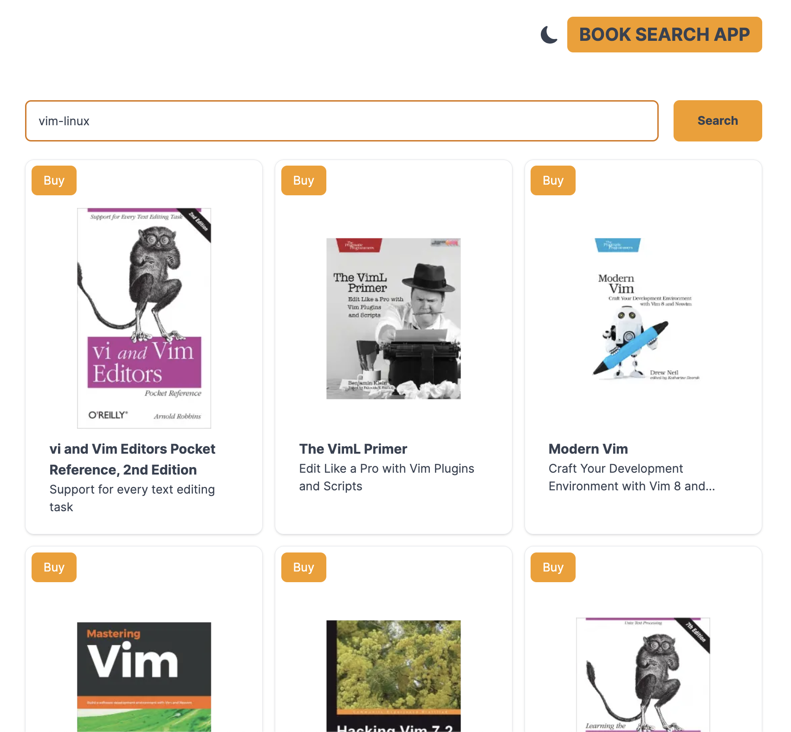

## 설명

- 소개
  - 도서 서적 불러오기 및 상세 페이지 만들기
- 디렉토리 구조
  - actions
    - fetchBooksByQuery.ts (→ 키워드로 검색 된 서적 정보 불러오는 api 함수)
    - fetchDetailPageByIsbn.ts (→ ISBN으로 검색 된 상세 페이지 api 함수)
  - app
    - search
      - [id]
        - page.tsx (→ ISBN로 검색 된 상세 페이지)
    - layout.tsx
    - page.tsx
  - component
    - layout
      - Header.tsx (→ Header section)
      - Footer.tsx (→ Footer section)
    - ui
      - BookLists.tsx (→ 검색한 도서 리스트를 보여주는 컴포넌트)
      - Card.tsx (→ 각 도서를 보여주는 컴포넌트)
      - SearchInputField.tsx (→ 검색 필드 컴포넌트)
      - Spinner.tsx (→ Circular progress 컴포넌트)
      - ThemeSwitch.tsx (→ 다크모드 컴포넌트)
  - theme
    - index.ts (→ 다크모드 provider)
  - types
    - index.ts (→ 타입 정리)
  - utils
    - LoadContinue.tsx (→ 스크롤 제일 아래로 내리면 다음 페이지 data fetching 하는 컴포넌트)

## 계획

1. 구현 과제에 대한 정리

   - 사용 스택
     - NextJS, typescript를 이용해 구현
   - 화면 구성
     - [리스트], [상세] 페이지
   - API
     - [리스트] 페이지에서는 검색된 서적 정보 구현
       - 키워드 검색을 통한 정보 API : <https://api.itbook.store/1.0/search/{keyword}>
       - 무한 스크롤로 페이지 업데이트 API : <https://api.itbook.store/1.0/search/{keyword}/{pageNumber}>
     - [상세] 페이지는 클릭한 서적의 상세 정보 구현
       - 상세 페이지 정보 API : <https://api.itbook.store/1.0/books/{isbn13}>

2. 검색 사용 방법

   - 일반 검색
     - 키워드를 입력한 후 Enter 혹은 Search 버튼 클릭으로 검색 가능
   - 'not' operator 검색
     - '-'로 사용하며, 띄워쓰기 여부는 상관 없이 적용 된다
     - ex) vim-linux (→ vim 도서 중 linux라는 단어가 제목에 포함 된 도서를 제외 시킨다)
   - 'or' operator 검색
     - '|'로 사용하며, 띄워쓰기 여부는 상관 없이 적용 된다
     - ex) vim|javascript (→ vim 도서와 javascript 도서 둘 다 노출된다. 단, '|' 앞에 온 단어의 도서가 먼저 보여진다)

3. 주석 처리
   - 누군가와 함께 작업하게 된다면 그 사람 입장에서 한 눈에 코드 구분이 됐으면 좋겠다 라는 생각을 했고, 그에 따라 크게 각 컴포넌트마다 "Property", "Function", "Render" 라는 주석으로 구분지어놨습니다.

## 사용 라이브러리

- NextJS
- typescript
- tailwindcss
- react-intersection-observer
- react-icons
- next-themes

## 결과

- 스크린샷 이미지
  
- 추가하면 좋을 기능
  - 항상 메인 페이지에서는 스크롤이 제일 위로 올라오도록 하기
  - 검색한 내용을 local storage나 DB에 쌓아두고 뒤로 가기해도 그대로 가지고 있도록 하기
  - 계속 무한 스크롤을 하면 위로 올리기 힘드므로, 스크롤 제일 위로 올리기 버튼 추가

## 최신 업데이트(2025. 09. 05)

✨ 성능 최적화

- SSG로 메인 페이지 즉시 로딩
- SSR로 검색 결과 SEO 최적화
- ISR로 상세 페이지 캐싱 + 최신 데이터

🔍 SEO 최적화

- 동적 메타데이터 생성
- OpenGraph, Twitter Cards
- 검색엔진 크롤러 친화적

⚡ 사용자 경험

- Suspense로 로딩 상태 개선
- Streaming으로 점진적 렌더링
- Server/Client 컴포넌트 최적 분리
